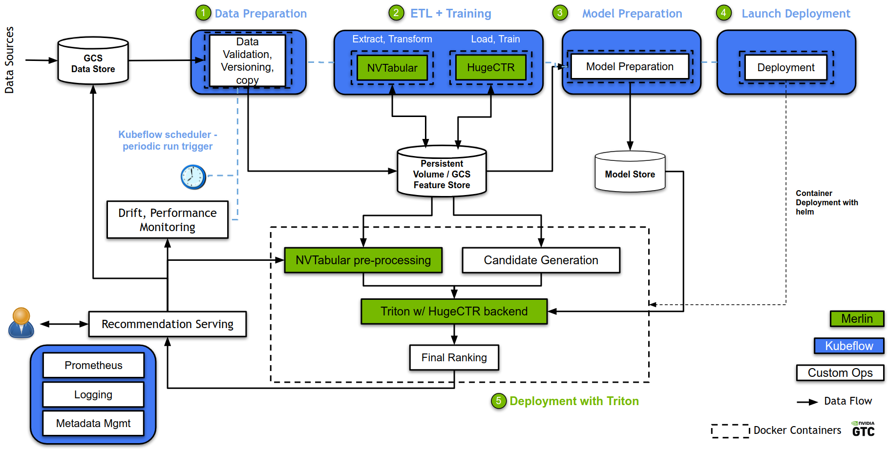

# Merlin - MLOps on GKE

## Introduction
[NVIDIA Merlin](https://developer.nvidia.com/nvidia-merlin) is an open-source application framework that facilitates the development and deployment of large-scale deep recommender systems on GPUs.

The figure below shows the architecture of a recommendation system example using NVIDIA Merlin on a [Kubeflow pipeline](https://www.kubeflow.org/docs/components/pipelines/overview/pipelines-overview/).

Through this, we intend to show an end-to-end reference architecture, all the way from data preparation, to model deployment, with features like continuous and fast re-training, autoscaling, and model monitoring.

For this example, we use the [Criteo 1TB Click Logs](https://ailab.criteo.com/download-criteo-1tb-click-logs-dataset/) dataset, a large publicly available dataset for recommender systems. It contains feature values and click feedback for millions of display ads. It is divided into 24 files, each one corresponding to one day of data.

## Running the example
Please follow the User Guide available [here](https://docs.google.com/document/d/1P_BerGSP5CNzGjGbRqgMrPcNaCmQuKUyodFaG0jlu9I/edit?usp=sharing)!

